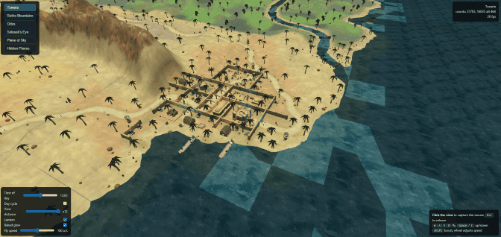

# eqoa_flythrough

A 3D noclip flythrough of the EverQuest Online Adventures worlds, rendered in
your browser. The geometry, textures, and lighting come straight from the
game's world archives (the .ESF files on the disc), and the renderer imitates
the PS2 engine's own pipeline, reverse engineered from the game binary. The
time-of-day sun and ambient colors, fog distances, sky color, material layer
blending, and baked static lighting (lava glow and dungeon light) all follow
the engine's actual tables and blend math.

  

## Running it

Open `map_viewer_3d.html` in a modern browser (Chrome/Edge/Firefox, WebGL2
required). No web server needed, it works straight off the disk. Pick a world
from the list on the left. Large worlds load in slices, terrain appears as it
streams in.

## Controls

- Click the view to capture the mouse, Esc releases it
- Mouse to look, W/A/S/D to fly, Space/C for straight up/down
- Shift to boost, mouse wheel or the Fly speed slider to change speed

## Settings

Every setting applies instantly, hover any of them for a description.

- **Time of day**, drives the sun angle and color, ambient light, fog, and
  sky, using the engine's 24-hour tables. **Day cycle** animates it.
- **View distance** multiplies the fog range. x1 is the authentic PS2 draw
  distance (fog from 250 to 800 world units), crank it up to see further than
  the game ever could.
- **Lantern**, a warm light around the camera imitating the game's personal
  light, most useful at night and in dungeons.
- **Baked glow**, the static light baked into the world data, like the orange
  glow around lava. Outdoors bake almost none, so this mostly matters in
  Solusek's Eye and other interiors.

## Deep links

The viewer accepts URL parameters to jump straight to a spot, for example
`map_viewer_3d.html?world=rathe&hour=19&x=6000&y=250&z=6000&yaw=0.8&pitch=-0.2`.
`world` matches the bundle file name prefix (tunaria, rathe, odus, lavastm,
planesky, secrets), coordinates are in-game /loc units.
